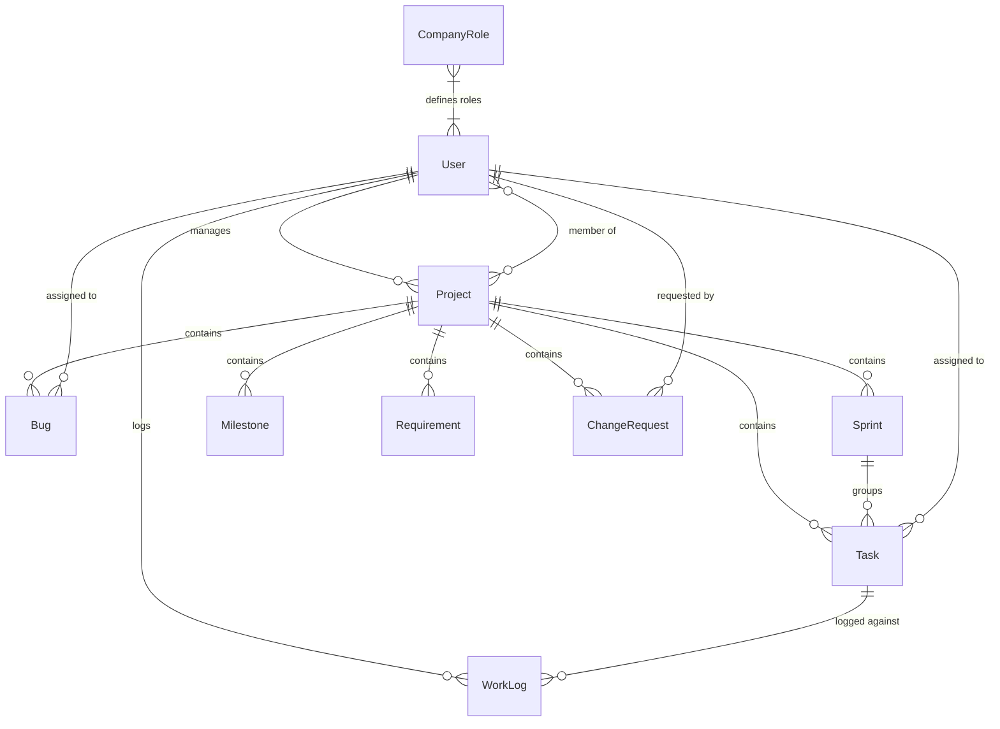

# DevTrack — Database Schema Reference

> **Database:** MongoDB (via Mongoose ODM)  
> **Location:** `backend/models/`  
> All schemas include automatic `createdAt` and `updatedAt` timestamps.

---

## Entity Relationship Overview

---

## Schemas

### 1. User
**Collection:** `users`

| Field | Type | Required | Constraints |
|---|---|---|---|
| `name` | String | ✅ | — |
| `email` | String | ✅ | Unique |
| `password` | String | ✅ | Bcrypt hashed |
| `role` | String | ✅ | Enum: `Admin`, `Manager`, `Developer`, `Tester` |
| `createdAt` | Date | auto | — |
| `updatedAt` | Date | auto | — |

**Access Rules:**
- Admin accounts cannot be created, edited, or deleted through the application UI/API
- Only Admins can create/edit/delete other users

---

### 2. Project
**Collection:** `projects`

| Field | Type | Required | Constraints |
|---|---|---|---|
| `title` | String | ✅ | — |
| `description` | String | ❌ | — |
| `manager` | ObjectId → User | ❌ | Auto-set to creator on create |
| `members` | [ObjectId → User] | ❌ | Array of project team members |
| `status` | String | ❌ | Enum: `Active`, `Completed`, `Archived` · Default: `Active` |
| `startDate` | Date | ❌ | — |
| `endDate` | Date | ❌ | — |
| `createdAt` | Date | auto | — |
| `updatedAt` | Date | auto | — |

**Access Rules:**
- Admin: full access to all projects
- Manager: sees/manages only projects where they are the `manager` or in `members`
- Developer/Tester: sees only projects where they are in `members`

---

### 3. Task
**Collection:** `tasks`

| Field | Type | Required | Constraints |
|---|---|---|---|
| `title` | String | ✅ | — |
| `description` | String | ❌ | — |
| `project` | ObjectId → Project | ❌ | Parent project |
| `sprint` | ObjectId → Sprint | ❌ | Optional sprint assignment |
| `assignedTo` | ObjectId → User | ❌ | Must be a project member |
| `priority` | String | ❌ | Enum: `Low`, `Medium`, `High` · Default: `Medium` |
| `status` | String | ❌ | Enum: `To Do`, `In Progress`, `Done` · Default: `To Do` |
| `dueDate` | Date | ❌ | — |
| `createdAt` | Date | auto | — |
| `updatedAt` | Date | auto | — |

---

### 4. Bug
**Collection:** `bugs`

| Field | Type | Required | Constraints |
|---|---|---|---|
| `title` | String | ✅ | — |
| `description` | String | ❌ | — |
| `project` | ObjectId → Project | ❌ | Parent project |
| `severity` | String | ❌ | Enum: `Minor`, `Major`, `Critical` · Default: `Minor` |
| `status` | String | ❌ | Enum: `Open`, `In Progress`, `Resolved`, `Closed` · Default: `Open` |
| `assignedTo` | ObjectId → User | ❌ | Project member responsible for fix |
| `createdAt` | Date | auto | — |
| `updatedAt` | Date | auto | — |

---

### 5. Sprint
**Collection:** `sprints`

| Field | Type | Required | Constraints |
|---|---|---|---|
| `project` | ObjectId → Project | ❌ | Parent project |
| `name` | String | ❌ | — |
| `startDate` | Date | ❌ | — |
| `endDate` | Date | ❌ | — |
| `status` | String | ❌ | Enum: `Planned`, `Active`, `Completed` · Default: `Planned` |
| `createdAt` | Date | auto | — |
| `updatedAt` | Date | auto | — |

---

### 6. Milestone
**Collection:** `milestones`

| Field | Type | Required | Constraints |
|---|---|---|---|
| `project` | ObjectId → Project | ✅ | Parent project |
| `title` | String | ✅ | — |
| `description` | String | ❌ | — |
| `dueDate` | Date | ❌ | — |
| `status` | String | ❌ | Enum: `Pending`, `In Progress`, `Completed`, `Approved` · Default: `Pending` |
| `completedAt` | Date | ❌ | Set when status → Completed |
| `createdAt` | Date | auto | — |
| `updatedAt` | Date | auto | — |

---

### 7. WorkLog
**Collection:** `worklogs`

| Field | Type | Required | Constraints |
|---|---|---|---|
| `user` | ObjectId → User | ❌ | Who logged the time |
| `task` | ObjectId → Task | ❌ | Task the time was spent on |
| `hours` | Number | ✅ | Hours worked |
| `date` | Date | ❌ | Default: now |
| `createdAt` | Date | auto | — |
| `updatedAt` | Date | auto | — |

---

### 8. Requirement
**Collection:** `requirements`

| Field | Type | Required | Constraints |
|---|---|---|---|
| `project` | ObjectId → Project | ✅ | Parent project |
| `title` | String | ✅ | — |
| `description` | String | ❌ | — |
| `type` | String | ❌ | Enum: `Functional`, `Non-Functional`, `Technical` · Default: `Functional` |
| `priority` | String | ❌ | Enum: `Low`, `Medium`, `High` · Default: `Medium` |
| `status` | String | ❌ | Enum: `Draft`, `Approved`, `Implemented`, `Rejected` · Default: `Draft` |
| `documentUrl` | String | ❌ | Link to external requirement doc |
| `createdAt` | Date | auto | — |
| `updatedAt` | Date | auto | — |

---

### 9. ChangeRequest
**Collection:** `changerequests`

| Field | Type | Required | Constraints |
|---|---|---|---|
| `project` | ObjectId → Project | ✅ | Parent project |
| `title` | String | ✅ | — |
| `description` | String | ❌ | — |
| `requestedBy` | ObjectId → User | ❌ | User who submitted the CR |
| `status` | String | ❌ | Enum: `Submitted`, `Under Review`, `Approved`, `Rejected`, `Implemented` · Default: `Submitted` |
| `priority` | String | ❌ | Enum: `Low`, `Medium`, `High` · Default: `Medium` |
| `impact` | String | ❌ | Description of impact |
| `createdAt` | Date | auto | — |
| `updatedAt` | Date | auto | — |

---

### 10. CompanyRole
**Collection:** `companyroles`

| Field | Type | Required | Constraints |
|---|---|---|---|
| `name` | String | ✅ | Unique, trimmed |
| `description` | String | ❌ | Default: `""` |
| `isSystem` | Boolean | ❌ | Default: `false` — marks built-in roles |
| `createdAt` | Date | auto | — |
| `updatedAt` | Date | auto | — |

---

## Summary

| # | Collection | Documents | Purpose |
|---|---|---|---|
| 1 | `users` | User accounts | Authentication & authorization |
| 2 | `projects` | Projects | Top-level workspace |
| 3 | `tasks` | Tasks | Work items within a project |
| 4 | `bugs` | Bugs | Defect tracking |
| 5 | `sprints` | Sprints | Time-boxed iterations |
| 6 | `milestones` | Milestones | Key deliverable checkpoints |
| 7 | `worklogs` | Work Logs | Time tracking per task |
| 8 | `requirements` | Requirements | Functional/non-functional specs |
| 9 | `changerequests` | Change Requests | Scope change management |
| 10 | `companyroles` | Company Roles | Custom role definitions |
